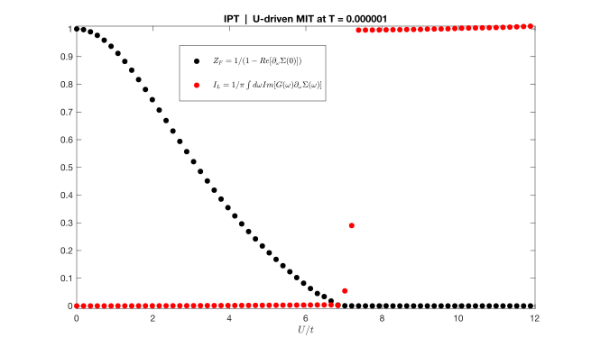
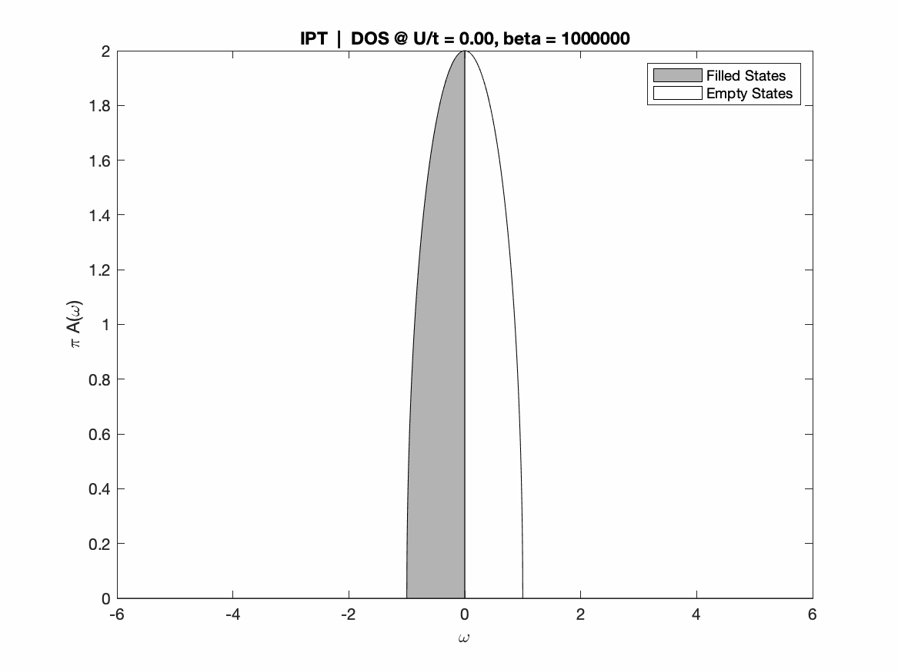
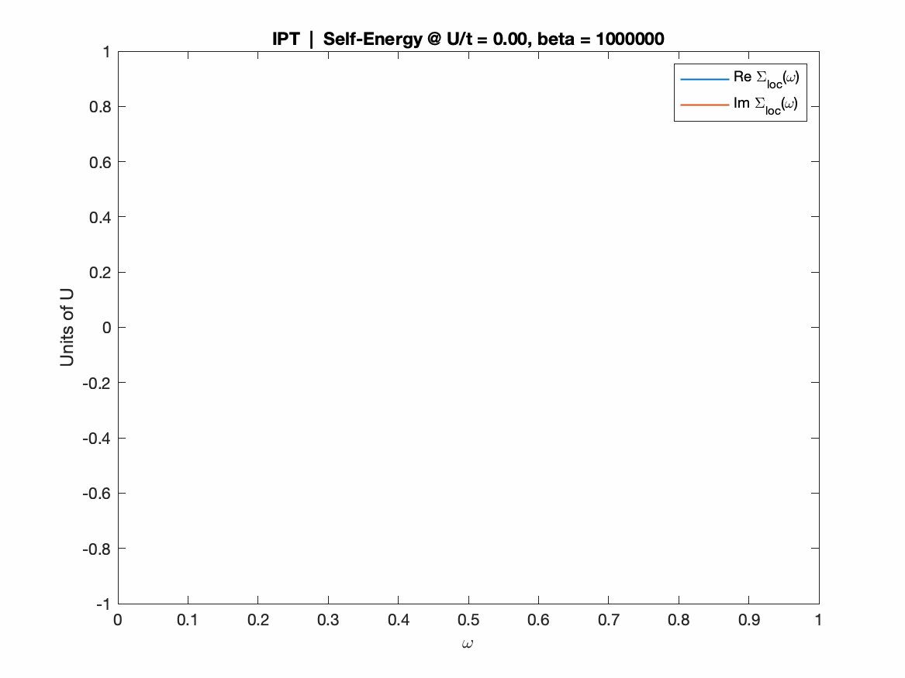
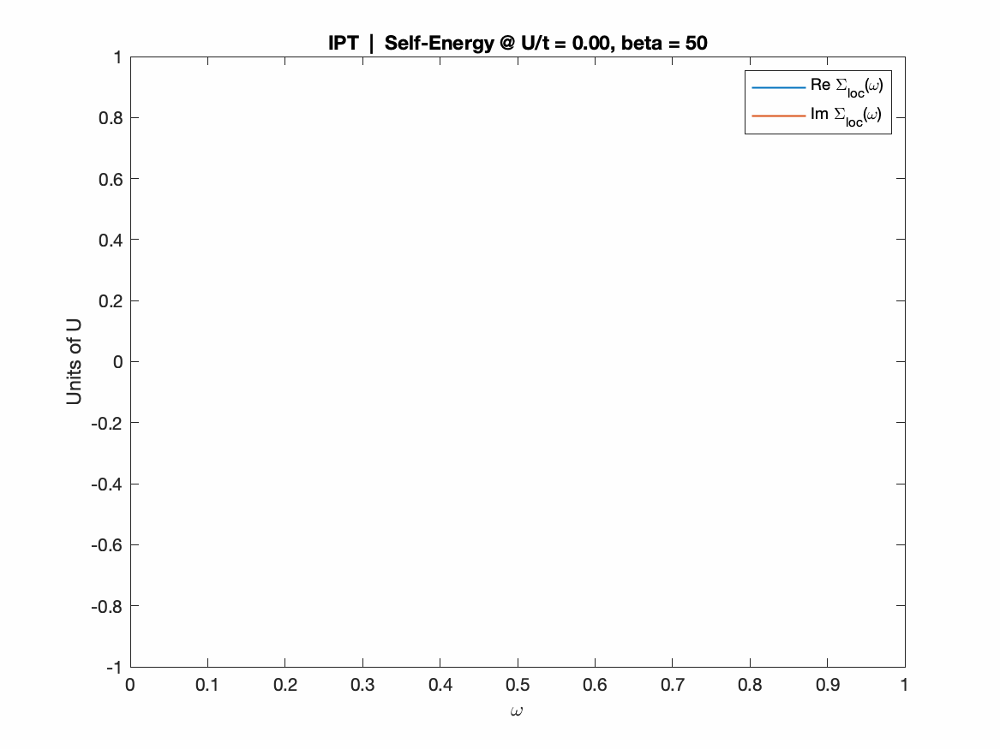
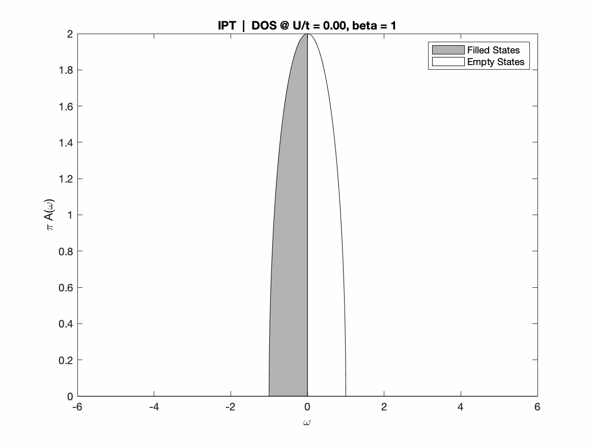
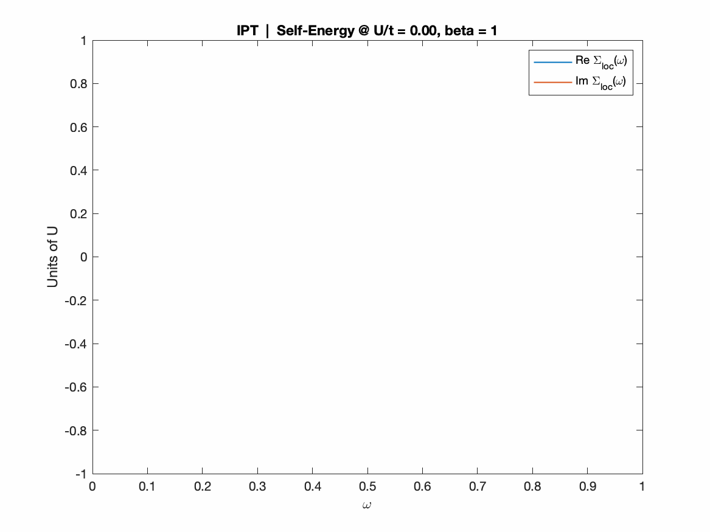

## What `MOTTlab` is
An efficient implementation of (real axis) IPT-based dynamical mean-field theory for the half-filled Mott-Hubbard transition on the Bethe lattice, within pure MATLAB.

## What you can get out of it
Here we present a few examples of what you can obtain fiddling around the `MOTTlab`.

> Characterize the interaction-driven quantum Mott transition through different physical markers, such as the _timeless classic_ quasiparticle renormalization weight _Z<sub>F</sub>_ , or the _quantized_ Luttinger integral _I<sub>L</sub>_, getting some exotic hints of a topological interpretation.

 

> Truly visualize what happens at different relevant temperatures by means of pretty animations!

 Temperature  | DOS | SELF-ENERGY
:-------------------------:|:-------------------------:|:-------------------------:
`T -> 0: 2nd order MIT` | |  
`Intermediate T: 1st order MIT`  | | 
`High T: supercritical MIT` | |   

## Dependencies
I've tried hard to avoid exceeding with the infamous MathWorks add-ons. At the moment the only additional dependence is the [Signal Processing Toolbox](https://it.mathworks.com/products/signal.html), which provides an efficient implementation of the discrete Hilbert transforms, at the earth of the numerical evaluation of the Kramers-Kronig relationships. Nevertheless I provide also a FOSS options, through [GNU Octave](https://www.gnu.org/software/octave/) packages.  

First of all you need to install the main software. The easiest way that I know is through Homebrew (you won't need sudo rights, they just take care of everything):

```
brew install octave
```

Then run an instance of Octave in your shell (just type `octave`) and install the [control package](https://octave.sourceforge.io/control/), by typing:

```
pkg install -forge control
```
Finally proceed to install the [signal package](https://octave.sourceforge.io/signal/index.html), which provides a FOSS implementation[^1] of the `hilbert()` function:

[^1]: note that while the MATLAB `fft` family is always built on top of [FFTW](https://www.fftw.org), with Octave you could end up wrapping [FFTPACK](https://www.netlib.org/fftpack/) instead, depending on how your binaries have been built.

```
pkg install -forge signal
```

You should now be set... enjoy! 

## Licensing and legacy code
This code has been implemented taking inspiration from these didactic sources:
1. [Kristjan Haule lecture on lattice vs local SOPT](http://www.physics.rutgers.edu/~haule/681/Perturbation.pdf) ([local copy](docs/haule_IPTtheory_rutgers.pdf)).
2. [Marcelo Rozenberg lecture on DMFT and the MIT](https://www.cond-mat.de/events/correl19/manuscripts/rozenberg.pdf) ([local copy](docs/rozenberg_review_julich.pdf))
and the [hands-on material](http://mycore.core-cloud.net/index.php/s/oAz0lIWuBM90Gqt) linked therein, in particular a tutorial-intended [jupyter notebook](legacy/PYTHON/real_ipt-text_v3.ipynb) provided by Óscar Nájera under the BSD 3-Clause License. 

Here we provide an efficient pure MATLAB rewrite of the original real-axis IPT algorithm, complemented by basic phase-diagram workflows, convergence and self-mixing control and various post-processing tools. Further material is being added gradually, with the aim to explore novel research ideas. You can find [here](./ROADMAP.md) a roadmap of the project, with a concise description of each addition and references to the relevant research papers. 

Everything mantains the original BSD 3-Clause License. You can read more about permitted use and conditions in the [LICENSE](./LICENSE) file.

## <kbd> © 2020 | Gabriele Bellomia 


