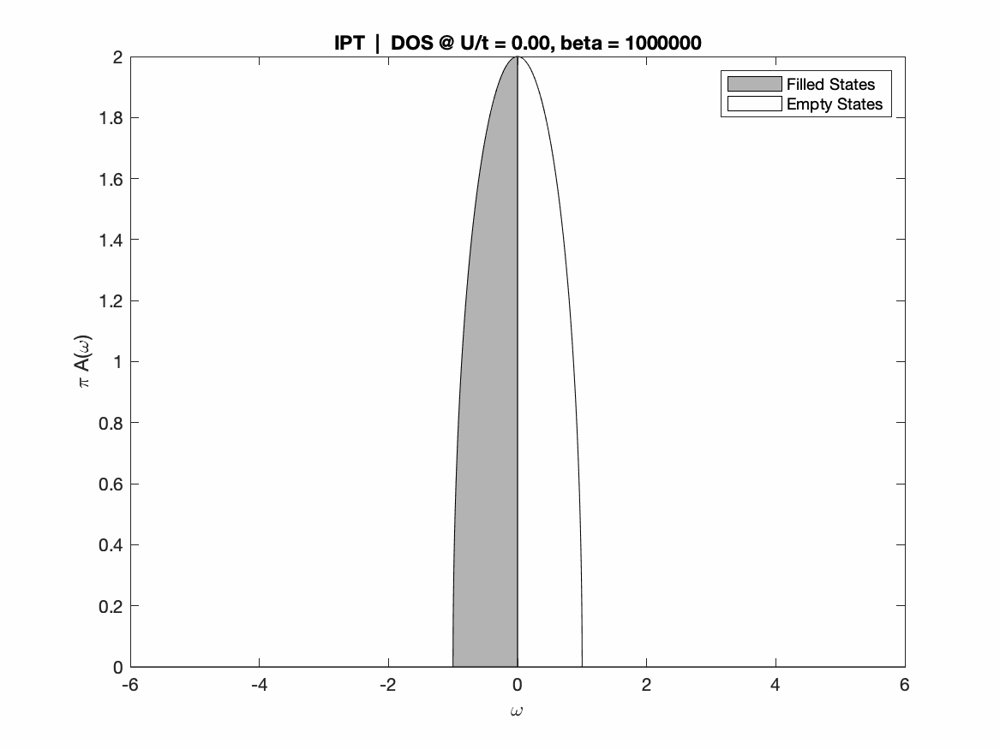
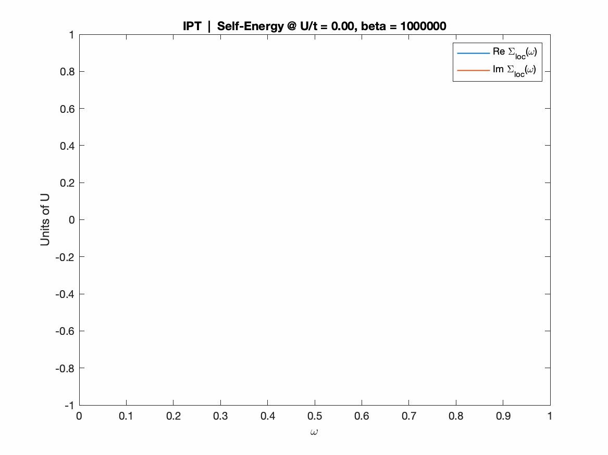
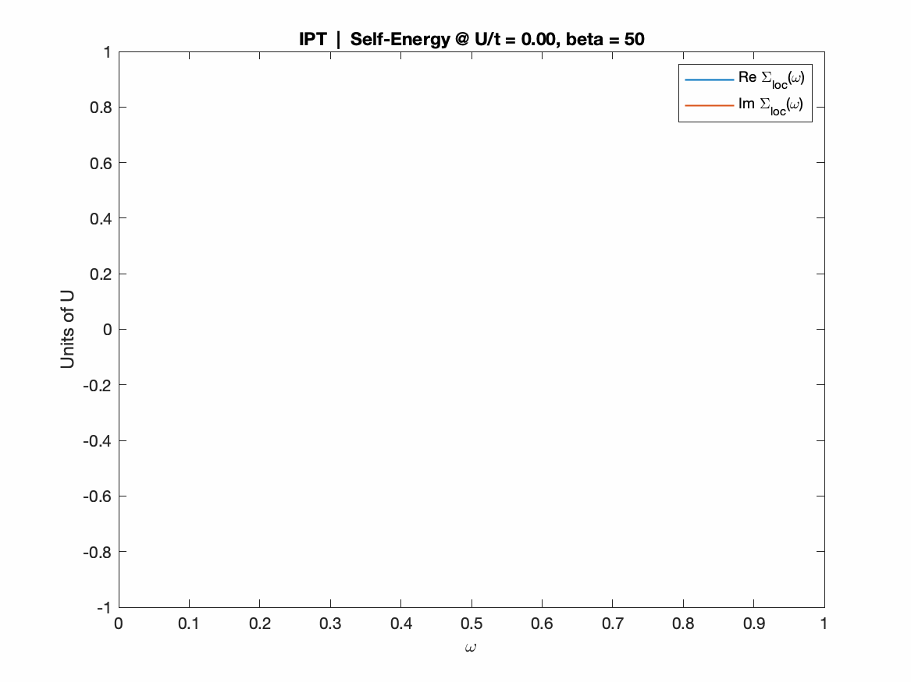
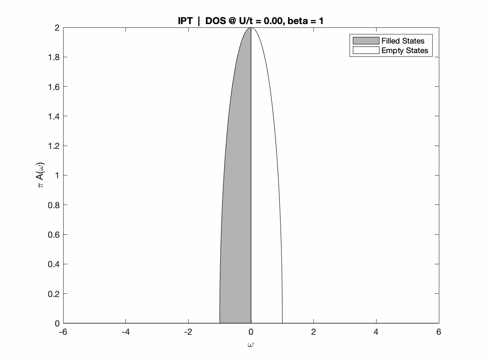
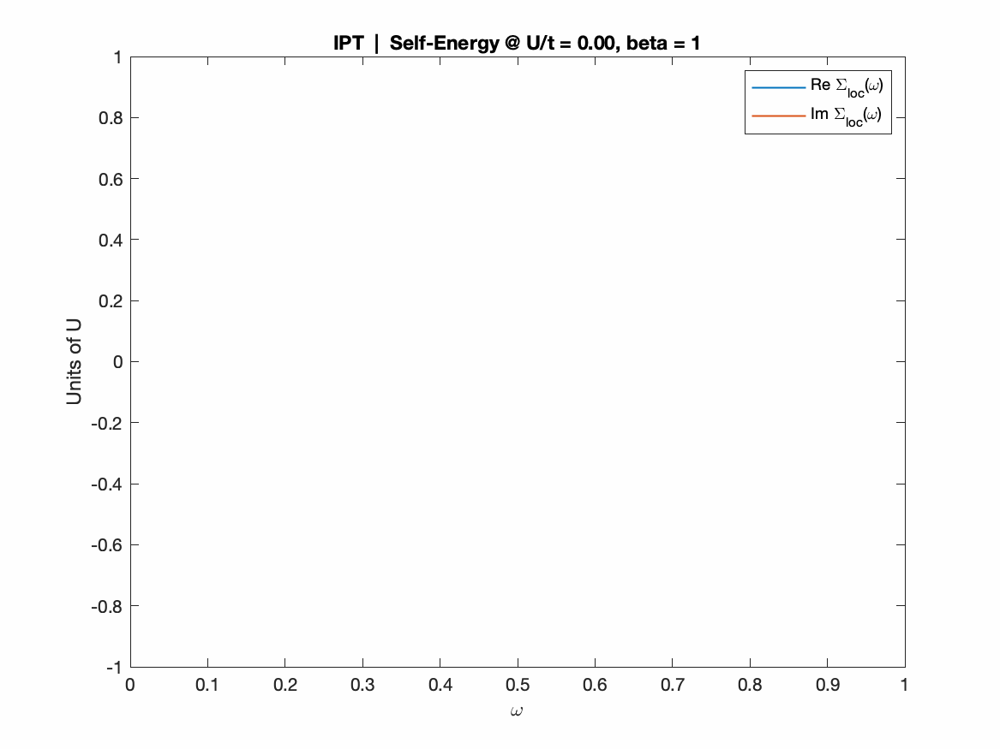

# What MOTTlab is
A didactic/explorative implementation of (real axis) IPT-based Dynamical Mean Field Theory for the half-filled Mott-Hubbard transition on the Bethe lattice, within Matlab language.

# License and stuff
This code has been implemented taking inspiration from these two didactic sources:
1. http://www.physics.rutgers.edu/~haule/681/Perturbation.pdf ([local copy](didactic_sources/haule_IPTtheory_rutgers.pdf))
2. https://www.cond-mat.de/events/correl19/manuscripts/rozenberg.pdf ([local copy](didactic_sources/rozenberg_review_julich.pdf))
and the hands-on material given therein, in particular a tutorial-intended jupyter notebook provided by Óscar Nájera (available [on his cloud](http://mycore.core-cloud.net/index.php/s/oAz0lIWuBM90Gqt), or [locally](najera_repo/PYTHON/real_ipt-text_v3.ipynb)) under the BSD 3-Clause License. Here we provide a Matlab rewrite, plus some extensions (phase diagram loops, including convergence and self-mixing control, various post-processing and data analysis routines), again under BSD 3-Clause License. You can read more about allowed use of this code in the LICENSE file.

A few fancy examples of what you can obtain running some simulation within the MOTTlab: visualizing the interaction-driven Mott transition at different relevant temperatures!

 Temperature  | DOS | SELF-ENERGY
:-------------------------:|:-------------------------:|:-------------------------:
`T -> 0: 2nd order MIT` | |  
`Intermediate T: 1st order MIT`  | | 
`High T: supercritical MIT` | |   

# TODO
- [ ] Insert a "restarting" protocol for full phase diagram spans. The gloc0=0 condition appers to be too unstable to obtain accurate UC1 lines. 
- [x] Compute a MIvsFL marker based on the divergence of Im[Sigma(0)] (much sensible, very inexpensive), so to obtain sharper phase diagrams with respect to the Z-derived ones.  
 At the moment we implement the "strenght of correlations", S = norm[Sigma(0)-Sigma_HF], as defined in `PRL 114 185701`, with actual neat results: the marker is almost zero accross the whole FL phase and starts decreasing fast in the Mott insulator.
- [ ] Compute the Luttinger Integral, as defined in `PRB 102 081110(R)`. Since it appears to be quantized it could become the definitive _flag_ for phase diagrams; much better than Z or S for it is an _integer_.  
UPDATE: Luttinger Theorem currently works for the FL phase *only*; the MI integer result for now is missing, for it arises from the nonanalytic Mott pole in the self-energy, which requires the most careful numerical treatment.  
