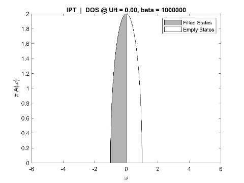
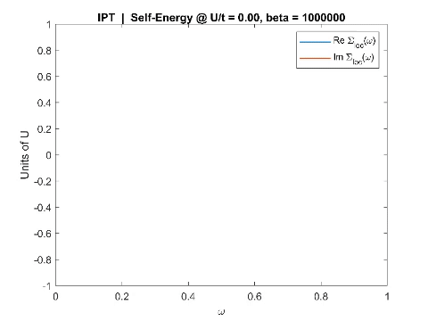

# What IPT.lab is
A didactic/explorative implementation of (real axis) IPT-based Dynamical Mean Field Theory for the half-filled Hubbard model on the Bethe lattice, within Matlab language (R2019a).

# License and stuff
This code has been implemented taking inspiration from these two didactic sources:
1. http://www.physics.rutgers.edu/~haule/681/Perturbation.pdf ([local copy](didactic_sources/haule_IPTtheory_rutgers.pdf))
2. https://www.cond-mat.de/events/correl19/manuscripts/rozenberg.pdf ([local copy](didactic_sources/rozenberg_review_julich.pdf))
and the hands-on material given therein, in particular a tutorial-intended jupyter notebook provided by Óscar Nájera (available [on his cloud](http://mycore.core-cloud.net/index.php/s/oAz0lIWuBM90Gqt), or [locally](najera_repo/PYTHON/real_ipt-text_v3.ipynb)) under the BSD 3-Clause License. Here we provide a Matlab rewrite, plus some extensions (phase diagram loops, including convergence and self-mixing control, various post-processing and data analysis routines), again under BSD 3-Clause License. You can read more about allowed use of this code in the LICENSE file.

A fancy example of what you can obtain running some simulation within the dMFTlab: visualizing an interaction-driven Mott transition!

 | 
:-------------------------:|:-------------------------:

# TODO
- [ ] Insert a "restarting" protocol for full phase diagram spans. The gloc0=0 condition appers to be too weak to obtain accurate UC1 lines.  
- [ ] Compute the Luttinger Integral, as defined in `Phys. Rev. B 102, 081110(R)` and `J. Phys.: Cond Mat 28 025601`. Since it appears to be quantized it could become the perfect _flag_ for phase diagrams; much better than Z. UPDATE: Luttinger Theorem now works for the FL phase *only*; the MI quantized result for now is missing, for it arises from the nonanalytic Mott pole, which needs for sure a careful numerical treatment.  
- [ ] An actual good MI vs FL marker could be just Im[Sigma(0)] (much sensible, very inexpensive), so we might substitute Z with it in the end...
