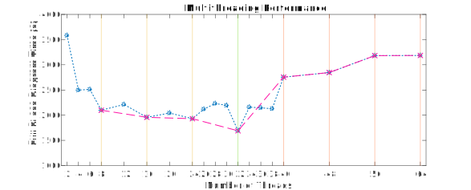

## Multicore optimization

MATLAB's [built-in multithreading](https://it.mathworks.com/discovery/matlab-multicore.html) allows for potentially faster execution of most performance-critical tasks in the code: mainly the [`fft()`](https://it.mathworks.com/help/matlab/ref/fft.html) calls within the IPT-solver ([`phys.sopt()`](https://github.com/bellomia/MOTTlab/blob/673cf68ee93f337c9dd44882dec6bd803e7bc46e/code/%2Bphys/sopt.m#L31-L39)) and the Kramers-Kronig transforms ([`math.fkkt()`](https://github.com/bellomia/MOTTlab/blob/673cf68ee93f337c9dd44882dec6bd803e7bc46e/code/%2Bmath/fkkt.m#L27)). 

The multicore performance has been carefully measured through the [provided slurm script](../../code/run.slurm), for a full phase-diagram scan defined by:

```
%% INPUT: Physical Parameters 
D = 1;                  % Bandwidth

%% INPUT: Boolean Flags
MottBIAS     = 0;       % Changes initial guess of gloc (strongly favours Mott phase)
ULINE        = 0;       % Takes and fixes the given beta value and performs a U-driven line
TLINE        = 0;       % Takes and fixes the given U value and performs a T-driven line
UTSCAN       = 1;       % Ignores both given U and beta values and builds a full phase diagram
SPECTRAL     = 0;       % Controls plotting of spectral functions
PLOT         = 0;       % Controls plotting of *all static* figures
GIF          = 0;       % Controls plotting of *animated* figures
DEBUG        = 0;       % Activates debug prints / plots / operations
FAST         = 1;       % Activates fast FFTW-based convolutions

%% INPUT: Control Parameters
mloop = 1000;           % Max number of DMFT iterations 
err   = 1e-5;           % Convergence threshold for self-consistency
mix   = 0.30;           % Mixing parameter for DMFT iterations (=1 means full update)
wres  = 2^15;           % Energy resolution in real-frequency axis
wcut  = 6.00;           % Energy cutoff in real-frequency axis
Umin  = 0.00;           % Hubbard U minimum value for phase diagrams
Ustep = 0.09;           % Hubbard U incremental step for phase diagrams
Umax  = 6.00;           % Hubbard U maximum value for phase diagrams
Tmin  = 1e-3;           % Temperature U minimum value for phase diagrams
Tstep = 1e-3;           % Temperature incremental step for phase diagrams
Tmax  = 5e-2;           % Temperature U maximum value for phase diagrams
dt    = 0.05;           % Frame duration in seconds (for GIF plotting)
```

> Please notice that all plotting has been avoided, so to have a measure of the pure computational time. Since real-life runs would totally include plots and file IO, you might need to slightly retune the HPC parameters to account for that, especially if gif-writing[^1] is involved. 

[^1]: GIF building is quite expensive on the total elapsed time.

The resulting[^2] scaling of the computational time is reported in the bottom figure, where you can notice that:

- The total elapsed time decreases fast until the tipical 8-core setup of a modern laptop. This is the performance you will probably get on your personal machine.
  
- Then we have a far slower speed-up down to the minimum elapsed time, found with 32 threads requested to the slurm resource manager.

- The elapsed time increases again quite fast after that, making the request of a bigger multicore setup not only wasteful, but also counterproductive.

- The scaling is not locally monotonic for the set of tested configurations, but local minima can be found at each multiple of eight (marked by vertical lines). The scaling for this special subset of configuration is much more natural, signaling some sort of optimization in communication or memory management.

- The 8-core, 16-core and 24-core local minima are almost equivalent in performance and the global optimum at 32 cores, despite getting a sizeble improvement, is not really far from them. 

 

In conclusion I would suggest to perform single runs just on your personal workstation, so to exploit all the interactive plotting features, without worrying about a severe performance restraint. An HPC workflow would instead be advised whenever you want to do a lot of runs, with slightly different input state (e.g. doing many U-driven roundtrips, each with a different fixed temeperature, with the aim of plotting and saving all the Z vs U curves). That would make for an ideal use case for an _array_ job, making you exploit the HPC facility as an army of workstations at your service! :)

[^2]: The test runs have been carried out within the [Ulysses v2](https://www.itcs.sissa.it/services/computing/hpc) HPC facility at [SISSA](https://www.sissa.it).

## Distributed computing

Some form of distrubuted computing is implemented for only the two-dimensional phase diagrams: the external (temperature) loops are parallelized through the native `parfor` construct, which autodetects the number of available physical cores and activates a corresponding number of independent 'workers'. This is reasonable within the assumption that each internal U-driven line starts at a sufficiently low interaction, so to make unuseful a restarting protocol that connects lines at different temperatures. No profiling has been done so far on this procedure.

> NB. If the Parallel Computing Toolbox is not installed (or if you are running GNU Octave) the `parfor` construct acts as an alias of the traditional sequential `for` loop.
